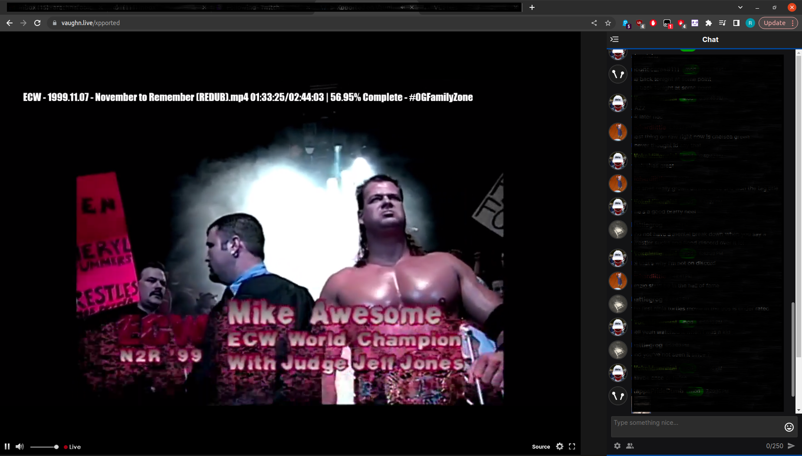

# VLSolutions
Monkey Scripts to change certain things on vaugh.live

I made these scripts after vaughn.live started running a new layout and removed theatre mode.
All 4 together mimic a theatre mode as close as I could get it.
It was split into 4 scripts so one can choose to keep something on the layout if one preffers it.

First off all, in order to use these scripts one will need [Tampermonkey](https://www.tampermonkey.net/).
After installing, clicking on any of the script links below will directly offer to install them.

Use the following script for the chatbox to have the height like the old chat had.
[Larger-Chatbox.user.js](https://github.com/arachnafobic/VLSolutions/raw/main/Larger-Chatbox.user.js)

If one wants to get something akin to theatre mode, the following script will do most of that.
[TheatreMode-Main.user.js](https://github.com/arachnafobic/VLSolutions/raw/main/TheatreMode-Main.user.js)

To Automatic close the left sidebar with trending channels, add the following script aswell.
[TheatreMode-LeftSidebar.user.js](https://github.com/arachnafobic/VLSolutions/raw/main/TheatreMode-LeftSidebar.user.js)

To Remove the top bar add the final script aswell.
[TheatreMode-RemoveTopbar.user.js](https://github.com/arachnafobic/VLSolutions/raw/main/TheatreMode-RemoveTopbar.user.js)

if you run all 4 scripts together, a channel will look like this :

